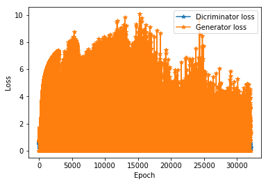
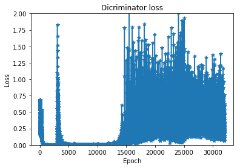
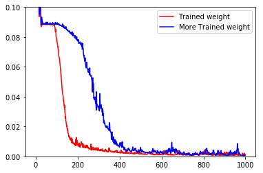
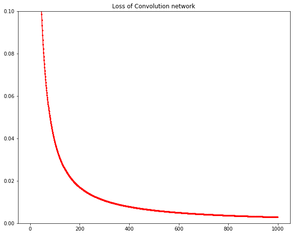
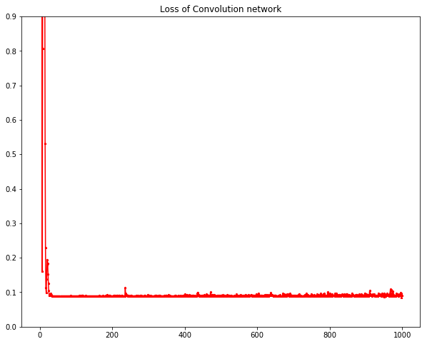

Maybe Opitimizer have some problem.

I can't understand what happen to GAN. Even training Discriminator twice than Generator, it can't reduce the loss of discriminator.

 

it seems that the better the generator produce a spectrum, the worse the discrimiator used as classifier predict.

so what's the problem with it??
there are some reason to verify:

* maybe 40 samples just not enough. -----> solution :use more eamples.
* maybe disciminator trainning loss curve may be a bit odd. you can see ,it increases.

* maybe it is completely unrealistic, it works well in classification,however maybe it's not suitable for regression.
* maybe there are another unknown reason for it.

**so what exactly is the reason can account for this unthinkable phenamenon?**

Now let's verify the first assumption. The test will be hold in  the mmist dataset, only use 40 samples just as same as the spectrum dataset.
Look at its result and compare with the former.

This test can tell us something about samples number. Both classifier models don't work well,we can guss that 40 samples,only 2.1%(40/1867=2.1% , samples / wave length can be defined as sample density ) samples used to establish model is far from enough. we need more samples to decrease sample sparsity.Here comes a question.

**what exactly is the value of sample density ?**  I have been proved that sample density 76.5% (600/784=76.5%) works well before and it seems that the bigger sample density ,the better the classifier will be .we can conclude as:

> Proposition: Sample density need to be enough to do regression.

so next stage is that do experienment in dataset of 594 samples:

> tune the SVM model and try some predictive label.
>> tune the MLP model to guarantee that the D G have the right structure.
>>> tuen the GAN model
